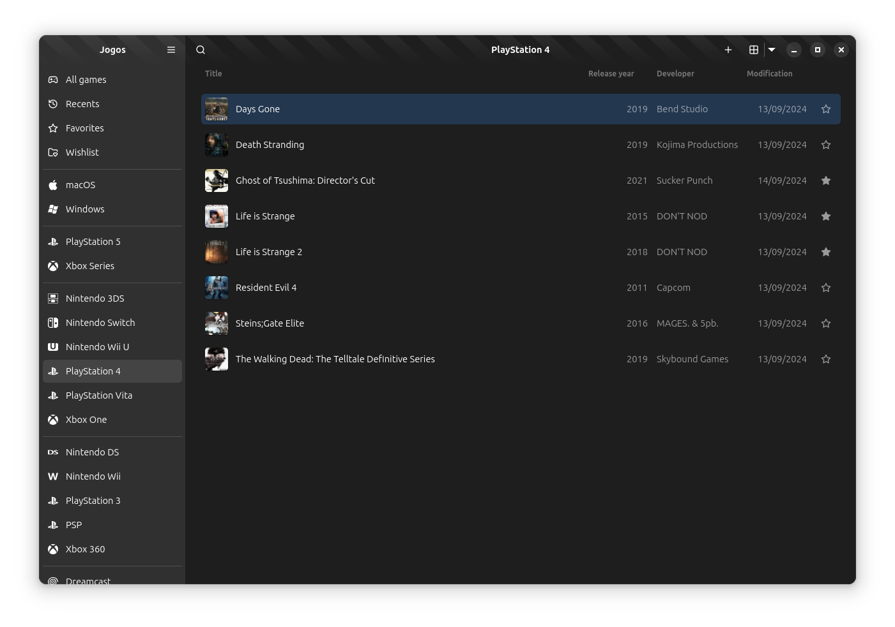

# Jogos

A simple physical game collection manager, created with GTK 4 and Libadwaita.

<p align="center">
  <picture style="width: 90%">
    <source media="(prefers-color-scheme: dark)" srcset="./.github/images/screenshot-dark.png">
    <source media="(prefers-color-scheme: light)" srcset="./.github/images/screenshot-light.png">
    
  </picture>
</p>

> [!WARNING]
> Jogos is under active development and is an ongoing **WIP**. Anyone is welcome
> to try it out, but do not expect a fully featured, bug-free experience. Some
> features will be missing and/or broken. Stay tuned for any news and future
> stable releases.

## Features

The following items are the major features aimed to be added to Jogos on the
initial releases.

- Import games from IGDB.com and OpenVGDB;
- Custom game creation;
- Statistics of the collection;

The project is open to suggestions and ideas, so feel free to reach out
if you have anything you'd like to see implemented.

## Download

As Jogos is still **WIP**, there's no public build yet. The plan is make
the project available to download through [Flathub] once it's usable.

[Flathub]: https://flathub.org/

## Contributing

Contributions are very **welcome**! Please review the [CONTRIBUTING.md] guide
before getting started.

[CONTRIBUTING.md]: CONTRIBUTING.md

### Setting Up Your Development Environment

#### Visual Studio Code

The project recommends using using [Visual Studio Code] with the following
extensions installed:

- ESLint by Microsoft
- Flatpak by Bilal Elmoussaoui
- XML by Red Hat
- EditorConfig for VS Code by EditorConfig
- Meson by mesonbuild
- Gtk Blueprint by Bodil Stokke

[Visual Studio Code]: https://flathub.org/apps/com.visualstudio.code

#### Flatpak

You will also need to install the GNOME Nightly flatpak SDK and the Node and
Typescript SDK extensions. First, add the flatpak repositories if you have
not already configured them.

In a terminal, run:

```console
$ flatpak remote-add --user --if-not-exists flathub https://flathub.org/repo/flathub.flatpakrepo
$ flatpak remote-add --user --if-not-exists flathub-beta https://flathub.org/beta-repo/flathub-beta.flatpakrepo
$ flatpak remote-add --user --if-not-exists gnome-nightly https://nightly.gnome.org/gnome-nightly.flatpakrepo
```

Then install the SDKs and extensions:

```console
$ flatpak --user install org.gnome.Sdk//master org.gnome.Platform//master
$ flatpak --user install org.freedesktop.Sdk.Extension.node20//24.08beta org.freedesktop.Sdk.Extension.typescript//24.08beta
```

Also ensure that you have `flatpak-builder` installed.

### Building and Running the App

When you open your project directory in VS Code, you should see a box icon on
the bottom left of your screen with your application ID. If you see this and
no errors, that means that the flatpak VS Code extension properly loaded
your project.

Open your command palette (View -> Command Palette in the menu bar, or
Ctrl+Shift+P) and type "Flatpak". Select "Flatpak: Build" from the list.
Once the build is done, open the command palette again and select
"Flatpak: Run". You should see the window depicted in the screenshot
at the top of this file.

After your initial build, you can use the "Flatpak: Build and Run" action
from the command palette to do both steps at once.

## Acknowledgements

Some icons and design decisions were inspired by the awesome work of
[Alice Mikhaylenko] in the [Highscore] application. Other icons are
from the icon packs [Lucide] and [Simple Icons].

[Alice Mikhaylenko]: https://gitlab.gnome.org/alicem
[Highscore]: https://gitlab.gnome.org/World/highscore
[Lucide]: https://lucide.dev
[Simple Icons]: https://simpleicons.org

## License

> You can check out the full license [here](LICENSE).

This repository is licensed under the terms of the **MIT** license.
